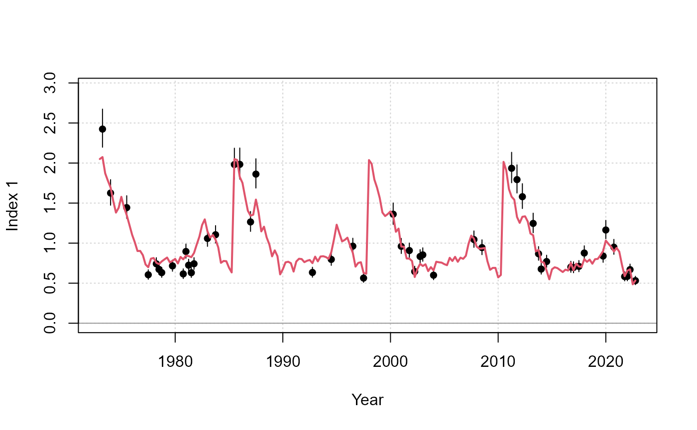
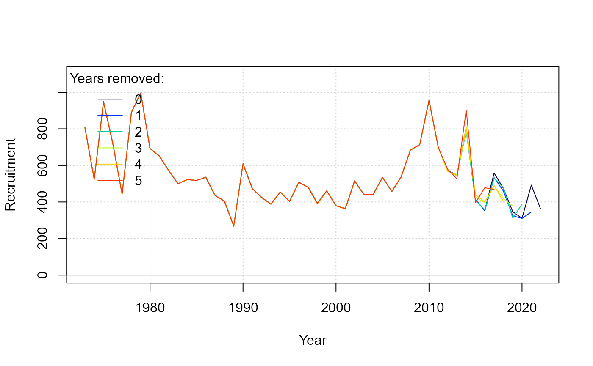

```{r, include = FALSE}
knitr::opts_chunk$set(
  collapse = TRUE,
  comment = "#>"
)
```

# Background

Traditional stock assessment have fitted population models on the assumption that the fishery and survey data represent the dynamics of a single unit population (typically represented as a "stock").
For some mixed-stock fisheries which display complex spatial, seasonal dynamics, these assumptions may be difficult to meet in order to estimate biomass and abundance for individual stocks. 
For example, the composition of fishery catches may be naively split among constituent stocks, or the trends in fishery catch per unit effort may be assumed to be equally representative for all stocks. 

These assumptions may not produce a defensible assessment.
If population mixing is quite variable across seasons and years, then the error from data processing can propagate significant error into the estimation framework. 

MARS (*Multi-stock Assessment with Regional Spatiotemporal dynamics*) is an age-structured model is intended to address these situations where an explicit multi-stock, seasonal, and spatial assessment model is desirable.

Some of the distinguishing features of MARS include:

- Explicit modeling of seasonal and spatial dynamics, with flexible parameterizations for stock movement and distribution
- Multi-stock modeling with fishery catches are not identified to the stock or species level. Instead, there is a separate likelihood for stock composition data to facilitate data weighting and profiling among other data types
- Fitting to close-kin genetic data to estimate individual stock size, especially if the populations are frequently well mixed in the fishery data

As a "next-generation" stock assessment package, MARS relies on state-of-the-art developments in computational power, optimization software, and along with important lessons learned from modeling mixed-stock marine fisheries, such as Atlantic bluefin tuna. 

MARS is entirely written in R and uses automatic differentiation enabled by RTMB for model fitting.

# Package overview

## Model fitting

Model fitting first starts with a S4 object of class `MARSdata`, with various slots to specify the model structure and data. See `help("MARSdata-class")`. `check_data()` scans the object and checks if the arrays are of the correct dimension and the necessary ancillary information are provided, e.g., sample sizes for compositional data.

Once the data object is set up, we can create the parameter object for RTMB with `make_parameters()`.
A list of starting values can be provided to override system defaults.
This function also calls `make_map()` which will create a list that specifies which parameters are fixed and mirrored.
A list of mapped parameters can be provided to override system defaults, with additional arguments as a shortcut.

The parameter and map set-up is finally checked with `check_parameters()` which reports the structure of the model to the console including start values and the parameters to be estimated.

These objects can then be passed to `fit_MARS()` which creates and fits the model:

```{r, eval = FALSE}
MARSdata <- check_data(MARSdata)
tmb_list <- make_parameters(MARSdata)

parameters <- check_parameters(tmb_list$p, tmb_list$map, MARSdata = MARSdata)

fit <- fit_MARS(MARSdata, parameters, map = tmb_list$map, random = tmb_list$random)
```

```{r fit, eval = TRUE, echo = FALSE}
#library(MARS)
#fit <- readRDS("../../scratch/multiarea_model.rds")
```

## Reporting 

Markdown reports generate a figures and tables for model estimates, ascertain goodness of fit, residuals, etc.

```{r, eval = FALSE}
report(fit)
```

```{r index, eval = TRUE, echo = FALSE}
#plot_index(fit, i = 1)

```

*Example figure that compares the fit in the observed and predicted index.*

The reporting function uses a variety of `plot_*()` functions that can be accessed by the user. 
View the options with `help("plot-MARS-data")` and `help("plot-MARS-state")`.

## Diagnostics

Various built-in functions run diagnostic procedures to evaluate model performance.

The `profile()` generic can profile up to two parameters simultaneously. The change in the likelihood and objective function can indicate how well the parameter is informed by the various data.
A two-parameter profile can identify potentially strong correlations between parameters.

```{r eval = FALSE}
prof_df <- profile(fit, "R0_s[1]", v1 = seq(750, 850, 25), "h_s[1]", v2 = seq(0.75, 0.95, 0.05))
plot(prof_df)
```

```{r prof, echo = FALSE}
#prof_df <- readRDS('../../scratch/prof_df.rds')
#plot(prof_df, main = "Change in objective function")

```

*Contour plot of the change in the objective function to unfished recruitment (x-axis) and steepness (y-axis) in stock 1.*

The `retrospective()` evaluates the consistency of model estimates as the data time series are truncated, starting with the most recent years. 
This diagnostic can inform model behavior in future assessments.

```{r eval = FALSE}
ret <- retrospective(fit)
report(ret)
summary(ret)
```

```{r ret, echo = FALSE}
#r <- readRDS(file = "../../scratch/multiarea_ret.rds")
#plot(r, "R_yst")

```

*Retrospective figure for recruitment estimates. The summary() generic reports Mohn's rho.*


The `simulate()` generic generates new observations by sampling from the probability density functions represented in the likelihood. 
Re-fit to these simulated values to ensure that the estimated parameters are retrievable.

